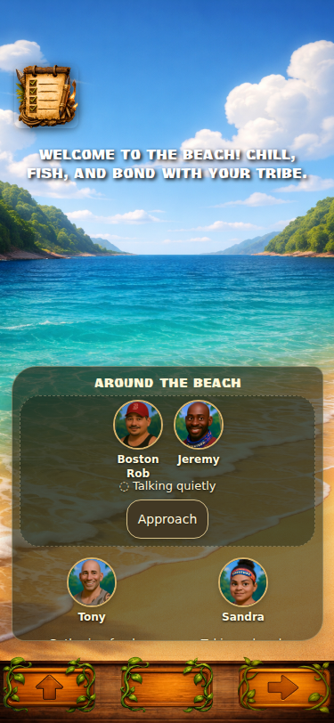
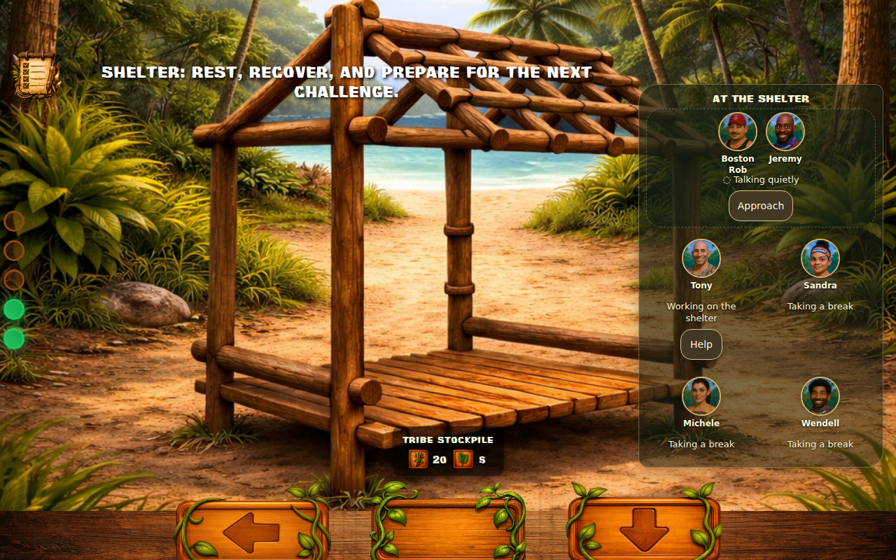
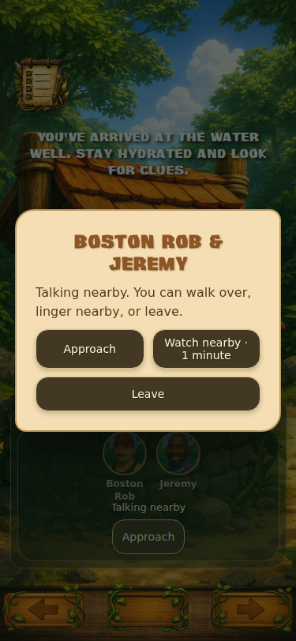

# Living Camp presentation validation

Base: current main `007c848` (merged #345), retaining #341–#345.

## Runtime inspected and preserved

Traced CampScreen's location loading, navigation, clock and Day 1 event gates; the physical location graph and centralized NpcAutoRenderer; CampActivitySystem's choice/start/travel/completion/interruption/reservation/restore paths; CampSocialResolution's actual exchanges; CampKnowledge and SocialMemory's owner-scoped evidence, capped history and persistence; ConversationSystem's player entry, menu rendering and conversation close; SocialEngine's camp approaches; relationships/trust, alliances/deals, tasks/checkpoints, IdolSystem and NPC idol AI; the six main location views and other physical locations; summary, save/load and responsive/Day 1 CSS. Checked the existing Strategy/Tribal knowledge consumers and regression suites.

No behavior coefficients, cast ratings, need costs, challenge/Last Flag, Strategy, Tribal, SeasonEngine or hands-on minigame mechanics changed. Navigation and island artwork remain. Tribe Flag's intentional **profile roster** remains separate from live nearby presence; its live presence starts collapsed.

## Presentation and encounters

- **Idol-holder fix:** one shared possession helper checks the contestant's own active IdolSystem inventory plus legacy `hasIdol`. A holder's ordinary search weight is zero next phase; an uninformed tribemate can still search. Hidden tribe-idol discovery is not an eligibility input.
- **One renderer:** NpcAutoRenderer consumes a small read-only `CampPresentation` projection. Only eligible members at the player's normalized physical location appear. Actual shared blocks/shared work form clusters; unrelated bystanders remain separate. Portrait positions are measured against the live container, with wrapping and scroll for crowded locations.
- **Observable labels:** work, breaks and travel are readable; hunting is “Looking around the trail,” investigation is “Watching the trail,” private groups are “Talking quietly.” Hidden targets, weights and motives never enter the projection.
- **Movement:** existing route steps cause arrivals/departures and portrait changes. A generic, bounded `moveTogether` extension reserves a pair through travel; a guarded pair may seek an empty adjacent location when approached. Departure witnesses see people and direction, not plans. No autonomous movement clock or per-frame AI was added.
- **Approach/join:** casual groups welcome the player; private groups may go quiet or relocate, using existing trust/relationships. Joining routes into the existing conversation menu with participant/location/privacy context and reserves the other NPC until chat ends. Fixed a UI rebuild that discarded that context. No duplicate social reward is granted for joining.
- **Watch:** one game minute, with normal NPC/needs progression. It provides temporary proximity for an exchange that actually resolves during that minute; it cannot conjure a transcript or guarantee a payoff.
- **Overhearing:** actual resolved utterances only. Co-location, privacy, nearby watching, occupation, noise and existing awareness bound hearing chance. Quiet conversation normally yields a name or an indistinct fragment; a nearby open conversation can yield a semantic statement. Indistinct fragments do **not** encode hidden subject IDs. Listener-owned evidence is projected into the player's existing SocialMemory with source chain, reduced confidence and no hidden lie markers. Hearing a false claim means hearing the statement, not discovering a lie. Unnoticed perceptions belong only to the observer; speakers and followed targets do not magically learn that the player saw/heard them.
- **Follow:** only a recent departure the player actually witnessed; two game minutes with everyone else progressing. Tracking can fail, reveal ordinary work/a visible search, or be noticed. Discovery creates firsthand player evidence; being caught creates one small relationship/trust consequence and memory for the target, not the whole tribe. No free repeat attempt after reload.
- **Help:** routes to the existing relevant minigame. During hands-on subviews, nearby presence starts collapsed and is read-only; activity/minigame controls remain clear.
- **Recap:** Camp Life, Tribe Needs and Your Social Read use the player's observations/received claims and visible shared supplies. Private NPC target plans and global social-change arithmetic are not consulted by the Living Camp recap.

## Persistence and accessibility

No save schema migration is required. Existing activity and SocialMemory serialization carries paired travel, observations and overheard claims. Old saves without the new optional observation metadata still work. Unsupported open dialogue/watch UI is reconstructed or closed; DOM, focus references, resize frame handles and native dialog state are never serialized. Completed activity IDs and owned observation IDs prevent duplicate outcomes, gossip and following consequences. Reload reconstructs groups without replaying old live announcements.

Portrait/actions use buttons, 44px minimum targets, useful labels and visible keyboard focus. Native modal dialogs provide focus containment and Escape; expired group sheets close and focus returns to an available control. Existing physical navigation wrappers are buttons. Motion respects reduced motion. Crowded mobile locations scroll intentionally; minigame presence is expandable without adding a new map/HUD.

## Automated results

- Baseline: **270/270** tests passing.
- Final complete `npm test`: **304/304** passing, including **34** new presentation/interaction/layout tests.
- Existing save/load, activity/checkpoint idempotence, production calibration, Day 1, idol/social, Strategy, Tribal, challenges, Last Flag and SeasonEngine coverage remains green.
- One old save test now finds the important owned memory by ID rather than assuming it must precede newly observed travel in the array.
- Existing #345 simulation harness, seeds 1–2, four days, nine scenarios: **576 camp phases / 60,640 activity choices** across its five tribe mixes and rotating production cast. Completed successfully; no coefficient tuning was performed.
- `git diff --check` passed. GameData, CampBehaviorProfile, CampTime, Strategy/Tribal and minigame formulas are unchanged.

## Rendered QA performed

Chromium **153.0.8010.0**, real CampScreen/location views and production renderer/systems, controlled semantic activities. **96 scenes:** Beach, Campfire, Shelter, Jungle Trail, Rocky Shore and Water Well, each with 1/2/3/6 NPCs at 375×812, 430×932, 844×390 and 1280×800. Checked one central layer, count/location agreement, portrait bounding boxes, horizontal overflow, container bounds and touch-target sizes. Screenshots were visually reviewed; this caught and corrected inherited low-contrast paragraph styles, oversized location intros, stale debug banners, dialog centering and a mobile stockpile-banner overlap. The stockpile/people separation is now asserted in rendered QA.

Additional browser checks: keyboard focus/Escape; Watch and Follow time costs; paired departure and arrival, disappearance from the prior location; actual existing group conversation and partner reservation/release; JSON restore; reduced motion; collapsed Firewood presence; live resize without re-entering a view. No uncaught page errors. This is rendered controlled-scene QA, not a full season playthrough or physical-device/Safari test.

Reproduce with an external/local Playwright installation (no new game dependency):

```sh
node qa/LivingCampRenderedQA.mjs
# Optional: PLAYWRIGHT_MODULE, CHROMIUM_EXECUTABLE_PATH, CAMP_QA_OUTPUT
node --test test/LivingCampPresentation.test.mjs
npm test
node qa/LivingCampSimulationHarness.mjs --seeds 2 --days 4 --output /tmp/camp-simulation.json
```

Representative captured scenes:





## Known limits / next pass

- The existing NPC social engine remains mainly pair-oriented. Visual/shared-work groups and player-joined pairs are supported; additional participants are physically reserved, but this does not add a three-person negotiation engine or automatically distribute every dialogue statement to them.
- Private relocation is an approach reaction, not a new autonomous privacy optimizer. The existing chooser still controls ordinary NPC plans.
- Overhearing samples semantic resolution, not continuous audio. Full statements are deliberately uncommon and limited to relatively open, nearby exchanges; guarded groups yield fragments or nothing.
- Following is bounded semantic tracking, not stealth/pathfinding. Ordinary presence does not reveal hidden intent, idol possession, or private contents.
- Movement uses current route steps and short presentation transitions, not full-screen walking choreography. Crowd scrolling is intentional on phones. The original Tribe Flag profile roster remains recognizable as membership information, not a live map.
- Presentation flags are transient. Reload can close an encounter and clear expansion/scroll state; owned knowledge, pending activities and outcomes survive.
- Next experiential work: richer in-art group placement, work gestures, directional walk-off choreography and contextual audible public dialogue—while preserving these knowledge boundaries and the validated simulation.
